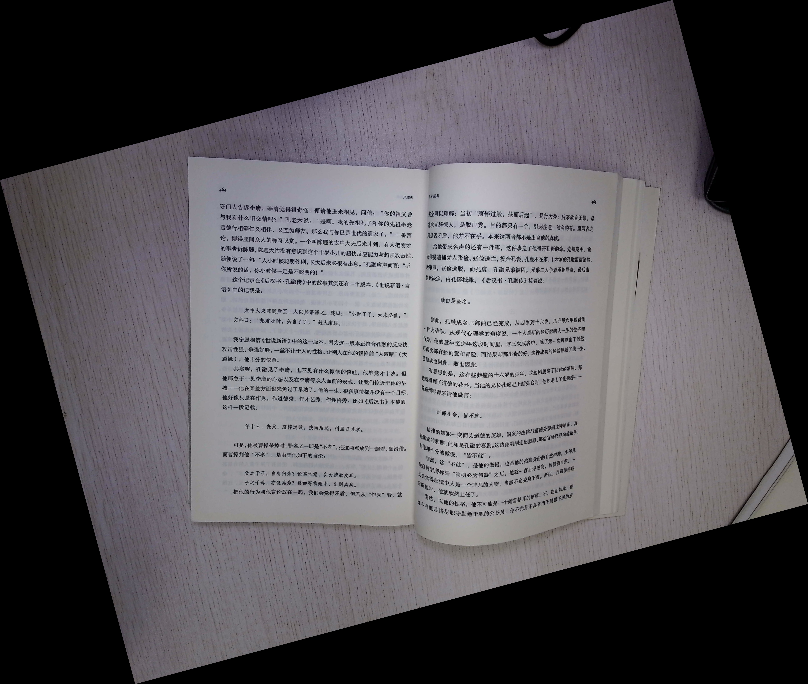
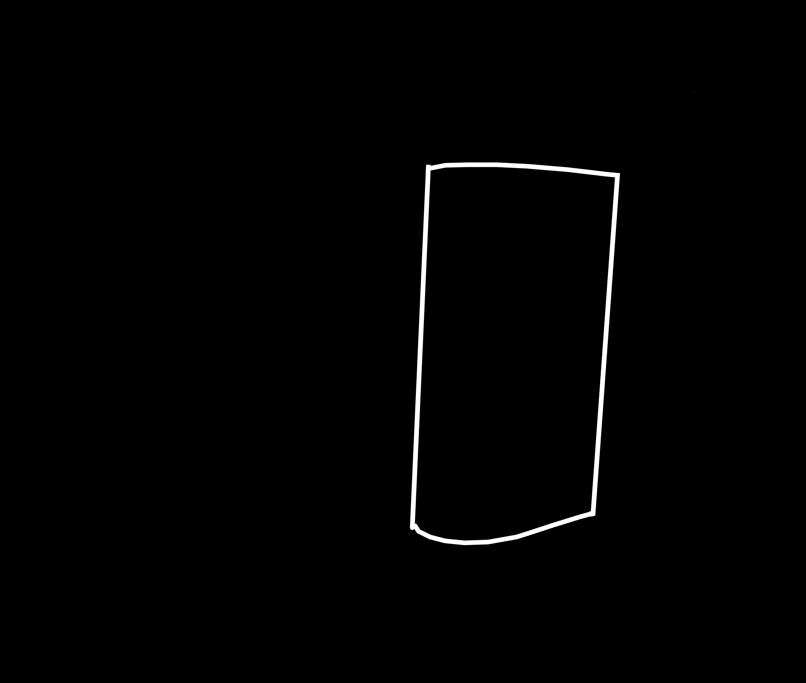
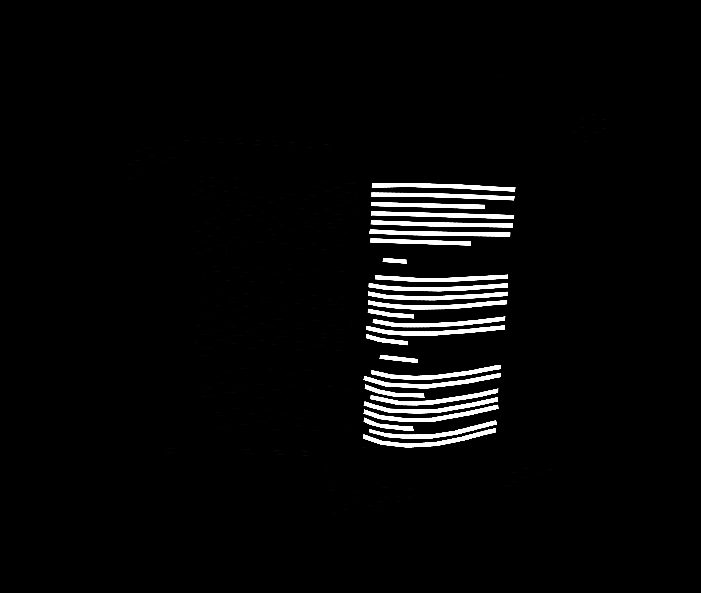
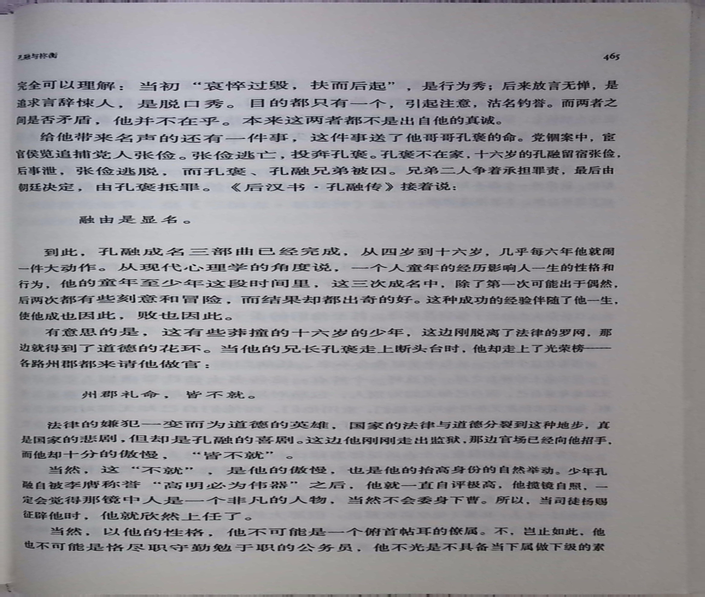
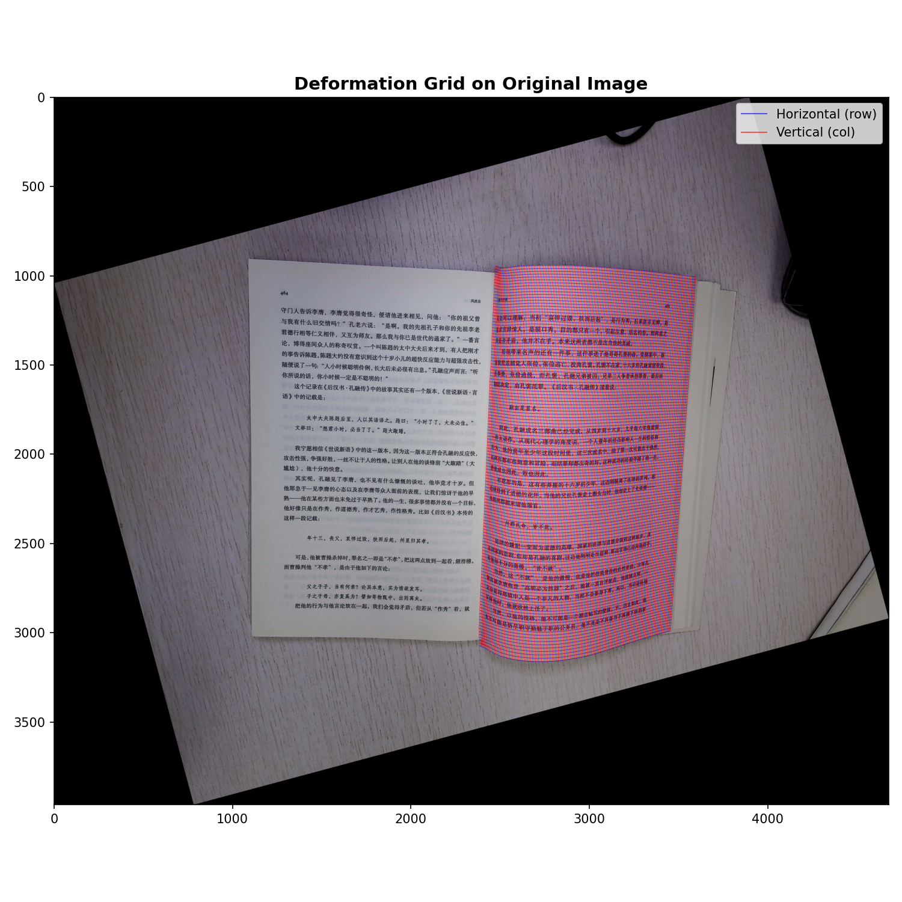
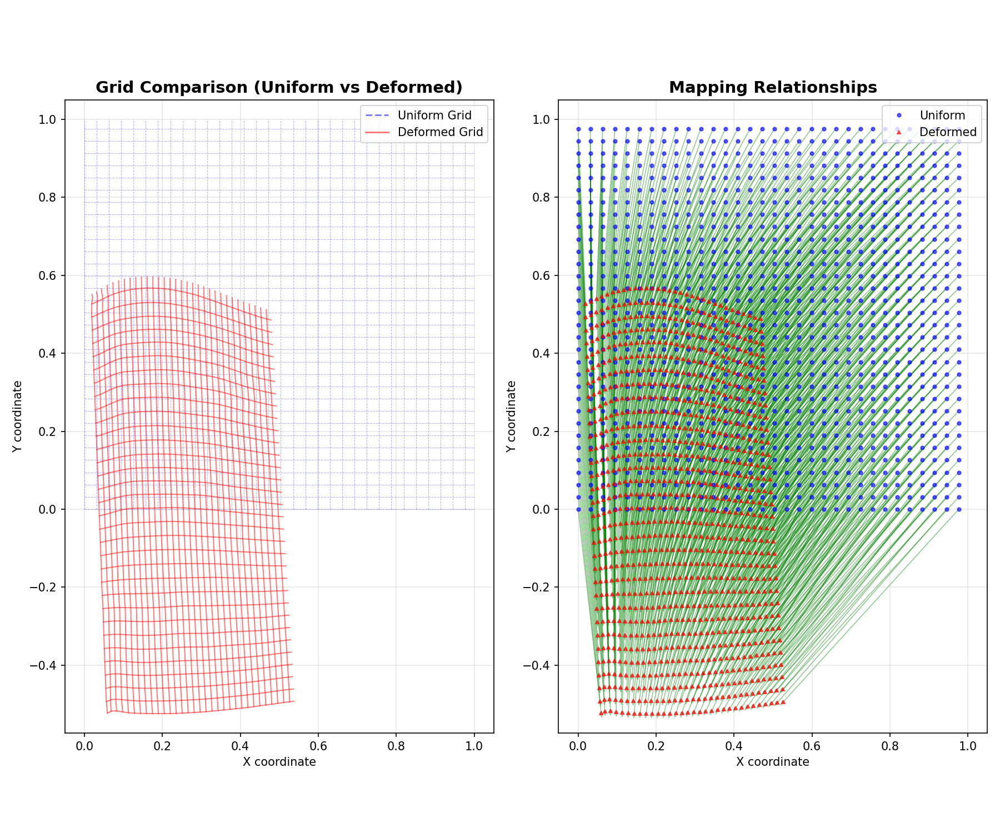

batch_dewarp.py的主要功能为：从文件夹中读取原始图像、边缘特征图像、文本行特征图像，进行弯曲校正处理。
调用脚本的命令示例：python batch_dewarp.py --input ./images --boundary ./masks/boundary --textline ./masks/textline --output ./result
需要指定以下参数：
  --input    : 原始图像文件夹       类型：字符串
  --boundary : 边界特征图文件夹       类型：字符串
  --textline : 文本行特征图文件夹       类型：字符串
  --output   : 矫正结果输出文件夹       类型：字符串
  --debug    : 是否保存形变场可视化（默认 False）          类型：bool

  

### 1. 各文件夹路径中特征图像样例

| 文件夹 | 图像示例 |
| -------- | ---------- |
| （输入）原始图像   |       |
| （输入）边界特征图    |       |
| （输入）文本行特征图    |       |
| （输出）结果图    |       |
| （输出）形变场可视化图1    |       |
| （输出）形变场可视化图1    |       |
