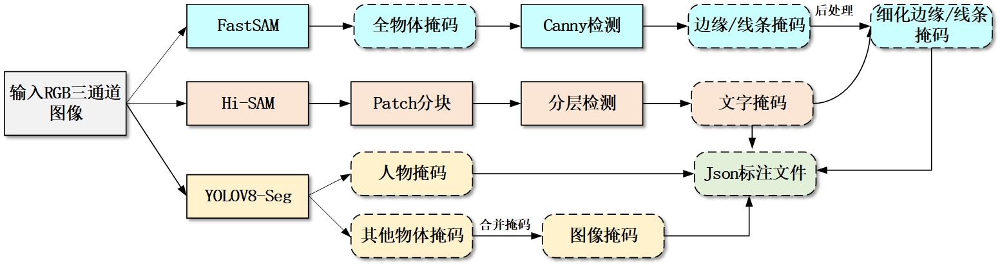

## 图像内容分割算法

### 背景

包含多类别元素的复合图像在文档数字化等领域的应用日益广泛，当前传统图像分割技术在面对复合图像时，常存在类别识别不全面、精准度不足等问题，尤其针对小文字区域等高精度要求目标，易出现误判为背景或噪音的情况，严重影响后续信息提取的准确性。本算法用于将输入的RGB 格式多类别扫描/拍摄图像，分割成背景、人物、文字、网纹/图像内容、线条/边缘等图像对象，并输出多通道类别掩码图像、COCO格式的JSON标注文件。

### 算法流程



1. 加载模型参数

读取命令行传入的输入图像路径、输出目录、各模型权重路径、置信度阈值等配置；创建输出目录；初始化COCO标注数据结构；加载FastSAM、Hi-SAM、YOLOv8-Seg三个模型。

2. 多模型推理

算法对每张图像进行串行多模型推理：

（1）FastSAM 推理：将“分割一切”任务拆解为全实例分割与提示引导选择两阶段。第一阶段通过 CNN backbone+FPN 提取多尺度特征，输出32个原型 + 掩码系数，通过系数×原型求和生成全场景实例掩码；第二阶段基于点、框、文本提示筛选目标区域。对输入RGB图像进行预处理后，通过everything prompt生成全场景物体掩码，再对每个物体掩码执行Canny边缘检测，合并得到线条/边缘掩码，同时保留原始物体掩码列表；

（2）Hi-SAM 推理：通过适配器微调在SAM的ViT backbone中插入少量可训练参数，结合自定义的自提示模块，将SAM转化为高精度像素级文本分割模型。支持Patch分块与分层检测模式，通过SAM Predictor提取图像特征后，生成高精度文本区域掩码，提升小文本、模糊文本的分割效果；

（3）YOLOv8-Seg推理：通过实例分割提取人体类别，直接生成单通道人体二值掩码，通过置信度与IoU阈值过滤无效检测结果。

3. 掩码后处理与优化阶段

针对三个模型输出的原始掩码，进行精细化后处理以消除冗余、提升类别区分度：

文本掩码：直接二值化后保存原始掩码，作为文字类别的核心输出；

边缘掩码：先对文本掩码进行膨胀操作，再去除边缘掩码中与文本区域重叠的部分，避免文字边缘被误判为线条/边缘，得到优化后的边缘掩码；

物体掩码：合并FastSAM输出的所有物体掩码，再通过文本掩码与边缘掩码构建排除区域，剔除文字与边缘区域，得到纯净的图像内容掩码；

人物掩码：二值化后通过像素占比过滤低置信度结果，确保人体区域完整性；

背景掩码：通过所有前景类别掩码取反，自动得到背景区域掩码，最终形成多通道类别掩码图像。

4. 保存结果

将处理后的各类掩码转换为标准化COCO格式标注：添加图像基础信息，再通过掩码转 RLE 算法计算每个类别的分割信息、面积与边界框（bbox），依次添加 text（文字）、edge（线条/边缘）、object（网纹/图像内容）、person（人物）四类标注信息，保存为 JSON 文件；同时保存多通道类别掩码图像。

### 开始

#### 1.环境配置

```powershell
git clone git@github.com:MorningStar2022/image-content-segmentation.git
conda create -n "环境名" python=3.8
conda activate "环境名"
pip install -r requirements.txt
```

#### 2.下载权重文件
[百度网盘](https://pan.baidu.com/s/1dWwtw2c9my-WUoBHiSKwNg?pwd=i8zj)(提取码：i8zj)
#### 3.运行代码

```sh
python predict.py --input ./input --output ./final_results --fastsam_checkpoint FastSAM/weights/FastSAM-x.pt --hisam_checkpoint Hi_SAM/pretrained_checkpoint/efficient_hi_sam_s.pth --hisam_model_type vit_s --device cuda:0 --text_dilate_pixel 10 --yolo_checkpoint yolo_weights/yolov8m-seg.pt
```
或者直接运行predict.py
